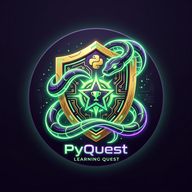

# 🐍 PyQuest 2.0 — Aprenda Python Jogando!

<div align="center">
  
  <p><em>Um jogo interativo e gamificado para aprender lógica de programação e Python!</em></p>
</div>

---

## 🌟 Sobre o Projeto

O **PyQuest 2.0** é uma plataforma de aprendizado gamificada desenvolvida em **React** projetada especialmente para estudantes iniciantes (como alunos de Ensino Médio/Técnico) dominarem os fundamentos de Python de maneira leve, visual e altamente interativa.

Diferente de cursos tradicionais de leitura, o PyQuest coloca você no controle de um personagem que avança por **15 fases sequenciais** resolvendo desafios de completar lacunas, quizzes teóricos e desafios reais de codificação.

---

## 🚀 Principais Funcionalidades

*   **🎮 Trilha Gamificada de 15 Níveis:** Do básico de variáveis e tipos (`int`, `float`, `str`, `bool`) até tomada de decisões complexas e operadores lógicos (`if`, `elif`, `else`, `and`, `or`).
*   **💻 Simulador Python Offline Inteligente:** Um interpretador simulado em JavaScript que analisa e valida o código escrito na hora, detectando erros clássicos de sintaxe (como falta de dois-pontos `:` ou problemas de indentação) de forma didática.
*   **🤖 Mentor Virtual "Professor Cobra":** Integração direta e opcional com a inteligência artificial da Anthropic (Claude) para fornecer dicas pedagógicas e personalizadas. O mentor nunca entrega a resposta pronta, forçando o estudante a pensar!
*   **🔊 Efeitos Sonoros Retro:** Um sintetizador de áudio nativo utilizando a Web Audio API do navegador, proporcionando arpejos cativantes de conquista ao acertar e alertas de erro.
*   **🏆 Conquistas & Ranks:** Ganho de XP, acompanhamento de sequência de acertos (*streaks*), liberação de medalhas exclusivas e evolução de patentes (de *Recruta Pythonista* até *Mestre das Condições*).
*   **💾 Progresso Salvo Automaticamente:** Integração com o `localStorage` do navegador para manter o XP, fases concluídas e medalhas salvas, mesmo se recarregar a página.

---

## 🛡️ Segurança e API Key

Para garantir a total privacidade e segurança dos seus dados, a chave da API do Claude é inserida **diretamente pelo usuário** na interface do jogo.
*   **Chave segura:** A chave fica salva localmente e de forma restrita apenas no seu navegador (`localStorage`).
*   **Custo zero no servidor:** O aplicativo faz requisições diretas do cliente para a API, eliminando custos de infraestrutura de servidor.
*   **Backup Offline:** Se você optar por não usar uma chave de API, o jogo continuará funcionando normalmente com as excelentes dicas pedagógicas estáticas (offline) do Professor Cobra.

---

## 🛠️ Como Executar Localmente

### Pré-requisitos
Certifique-se de ter o [Node.js](https://nodejs.org/) instalado na sua máquina.

### Passos
1.  **Clone o repositório:**
    ```bash
    git clone https://github.com/seu-usuario/pyquest.git
    cd pyquest
    ```

2.  **Instale as dependências:**
    ```bash
    npm install
    ```

3.  **Inicie o servidor de desenvolvimento:**
    ```bash
    npm start
    ```
    *Acesse [http://localhost:3000](http://localhost:3000) no seu navegador para ver o PyQuest em ação!*

---

## 🌐 Publicação e Deploy Rápido

O PyQuest é uma aplicação **Single Page Application (SPA)** estática, o que o torna ideal para hospedagem gratuita e de alta performance.

### ⚡ Opção Recomendada: Vercel ou Netlify
1.  Crie uma conta gratuita na [Vercel](https://vercel.com/) ou [Netlify](https://www.netlify.com/).
2.  Conecte sua conta do GitHub/GitLab.
3.  Selecione este repositório.
4.  O sistema detectará automaticamente que é um projeto **Create React App** e configurará o build correto. Basta clicar em **Deploy**!
5.  Em menos de 1 minuto, seu jogo estará no ar com link público e certificado SSL (HTTPS) gratuito.
