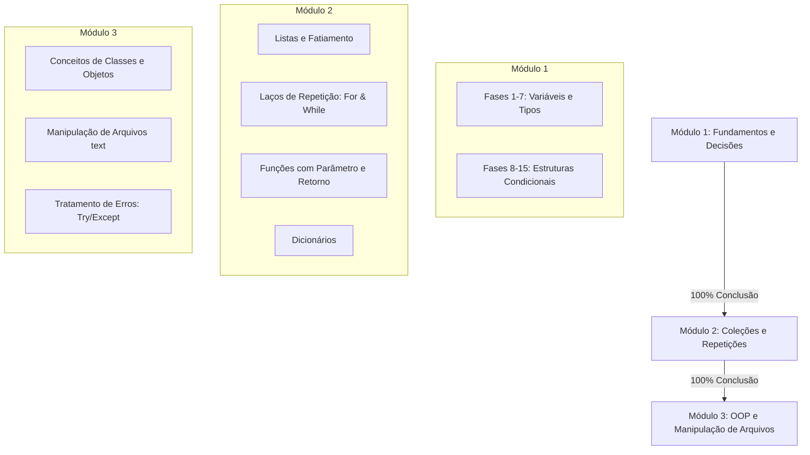

# Plano de Implementação: PyQuest 2.0 🐍

Este documento detalha o plano de desenvolvimento, reestruturação e expansão do PyQuest 2.0, estruturado a partir da perspectiva de um Engenheiro de Software Sênior. Nosso objetivo é transformar a aplicação atual em um ecossistema modular escalável, preparar a infraestrutura de testes e pavimentar o caminho para deploys contínuos na web (Vercel) e aplicativo nativo (Google Play Store).

---

## 🧐 Estado Atual da Aplicação

Ao analisar o código atual do repositório, identificamos os seguintes pontos fortes e oportunidades de melhoria:

### Pontos Fortes
1. **Simulador Python Offline Inteligente:** A solução contida em [interpreter.js](file:///home/paim/Projects/pyquest2.0/src/utils/interpreter.js) é engenhosa. Em vez de depender de uma API de execução pesada e cara em nuvem, ela analisa e simula a AST de Python localmente em JS, tornando o app extremamente rápido, offline e seguro contra injeção de código arbitrário.
2. **Didática Voltada ao Ensino Médio:** A divisão de fases com subpaths laterais (A e B) permite reforço conceitual rápido, muito alinhado com metodologias ativas de gamificação.
3. **Persistência Local Simples:** O uso de `localStorage` evita a fricção de login inicial obrigatório para os alunos.

### Oportunidades de Melhoria (Débitos Técnicos)
1. **Monolito no Frontend:** O arquivo [App.js](file:///home/paim/Projects/pyquest2.0/src/App.js) possui mais de 1.800 linhas de código misturando estados de persistência, lógica de áudio, navegação, lógica do quiz, renderização do console, editor de texto e todos os estilos inline. Isso dificulta a escalabilidade e manutenção.
2. **Estrutura Linear de Fases:** As fases em [questions.js](file:///home/paim/Projects/pyquest2.0/src/data/questions.js) estão definidas em um único array plano (`QUESTIONS`). Para suportar múltiplos módulos bloqueados e desbloqueáveis, precisamos hierarquizar a estrutura de dados.
3. **Limitações do Interpretador:** O interpretador em [interpreter.js](file:///home/paim/Projects/pyquest2.0/src/utils/interpreter.js) não suporta loops (`for`, `while`) nem estruturas de dados mais complexas como dicionários ou objetos (OOP), que serão fundamentais para os módulos intermediário e avançado.

---

## 🛠️ Nova Proposta de Módulos (Trilha de Aprendizado)

Atualmente, o PyQuest possui 18 fases misturadas (desde variáveis até listas e funções). Propomos dividir a jornada do aluno em **3 Módulos Progressivos**, onde a conclusão de um módulo destranca o seguinte:



### Detalhamento dos Módulos

#### Módulo 1: Introdução & Condicionais (Foco: Lógica Básica)
- **Fases:** Variáveis (`int`, `float`, `str`, `bool`), Regras de nomeação, Função `print()`, Condicionais (`if`, `elif`, `else`), Operadores de Comparação e Operadores Lógicos (`and`, `or`).
- **Desafio Final:** *A Balança da Febre* (Estrutura condicional completa com indentação obrigatória).

#### Módulo 2: Coleções & Laços de Repetição (Foco: Manipulação de Dados e Automação)
- **Novas Fases:**
  1. *Listas em Ação:* Criação de listas, acesso via índices positivos e negativos, fatiamento (`slice`).
  2. *Métodos de Listas:* Uso de `append()`, `remove()`, `pop()` e a função `len()`.
  3. *O Laço While:* Executar blocos de código enquanto uma condição for verdadeira (ex: contador de rodadas em jogos).
  4. *O Laço For:* Iterar sobre elementos de uma lista (`for item in lista`) e o uso de `range()`.
  5. *Dicionários:* O conceito de chave e valor para representar objetos estruturados (ex: atributos de um item de RPG).
  6. *Funções Avançadas:* Definição de funções com múltiplos parâmetros, escopo de variáveis e a palavra-chave `return`.
- **Desafio Final:** *O Inventário do Guerreiro* (Criar uma função que varre uma lista de itens e remove poções vazias usando laços e condicionais).

#### Módulo 3: Introdução à Programação Orientada a Objetos (OOP) & Arquivos (Foco: Práticas de Desenvolvimento Real)
- **Novas Fases:**
  1. *O que é um Objeto?:* Abstração de entidades reais para o computador.
  2. *Criando Classes:* Definição de classes com atributos básicos e o construtor `__init__`.
  3. *Métodos das Classes:* Funções internas das classes que utilizam o parâmetro `self`.
  4. *Tratamento de Erros:* Evitar que o programa quebre usando blocos `try` e `except`.
  5. *Persistência de Dados em Arquivos:* Leitura e escrita básica de arquivos usando `open()`, `read()`, `write()` e o bloco seguro `with`.
- **Desafio Final:** *O Gerador de Personagem NpC* (Construir uma classe que gera personagens salvando seus atributos em um arquivo `.txt` local).

---

## 🏗️ Proposta de Arquitetura de Software (Refatoração)

Para garantir que o app continue rápido e legível à medida que cresce, faremos a separação de responsabilidades na pasta `src/`:

```
src/
├── components/          # Componentes visuais isolados
│   ├── Header.jsx       # Barra superior de status, XP, streaks e conquistas
│   ├── LevelView.jsx    # Tela dividida (IDE à direita, teoria/mentor à esquerda)
│   ├── ModuleCard.jsx   # Card visual para selecionar/desbloquear módulos
│   ├── ModuleSelector.jsx# Tela de seleção de módulos
│   ├── Roadmap.jsx      # Trilha sinuosa SVG de um módulo específico
│   ├── Terminal.jsx     # Terminal de simulação Python
│   ├── QuizOptions.jsx  # Opções de clique para questões do tipo quiz
│   ├── Modals/          # Modals de configurações e conquistas
│   │   ├── BadgesModal.jsx
│   │   └── SettingsModal.jsx
│   └── Shared/          # Botões e inputs reutilizáveis
├── data/
│   ├── questions.js     # Estrutura modularizada dos dados de exercícios
│   └── modules.js       # Definição dos módulos principais
├── utils/
│   ├── audio.js         # Sintetizador nativo Web Audio API isolado
│   ├── interpreter.js   # Interpretador expandido com suporte a loops e estruturas
│   └── persistence.js   # Gerenciamento de leitura e escrita do localStorage
├── App.js               # Gerenciador de estado principal da aplicação (Navigation Router)
├── App.css              # Estilos globais estruturados
└── index.js
```

### Nova Estrutura do Arquivo [questions.js](file:///home/paim/Projects/pyquest2.0/src/data/questions.js)
```javascript
export const MODULES = [
  {
    id: "m1",
    title: "Módulo 1: Fundamentos",
    description: "Variáveis, tipos de dados e tomada de decisões",
    minXpRequired: 0,
    questions: [
      // Fases 1 a 15 atuais
    ]
  },
  {
    id: "m2",
    title: "Módulo 2: Repetições e Coleções",
    description: "Estruturas de repetição (Loops), listas e dicionários",
    minXpRequired: 150, // Requisito extra ou finalização do módulo 1
    questions: [
      // Fases 16 a 22 (Listas, loops, dicionários)
    ]
  },
  {
    id: "m3",
    title: "Módulo 3: Orientação a Objetos",
    description: "Classes, métodos, arquivos e tratamento de exceções",
    minXpRequired: 300,
    questions: [
      // Fases 23 a 30 (OOP, arquivos, try/except)
    ]
  }
];
```

---

## 🧪 Plano de Testes e Validação

Para garantir a qualidade de software exigida de um produto profissional, estruturaremos os testes em três frentes:

### 1. Testes de Unidade do Interpretador Python (Jest)
Como o interpretador Python em JavaScript é o coração lógico do app, cada nova funcionalidade do interpretador (ex: laços de repetição e dicionários) terá cobertura de testes unitários.
*   **Arquivo de Teste:** `src/utils/interpreter.test.js`
*   **O que testar:**
    *   Verificar se a atribuição de variáveis e condicionais continua funcionando.
    *   Verificar se blocos `for` e `while` executam o número correto de iterações.
    *   Verificar se o interpretador captura erros de indentação dentro dos laços.

### 2. Testes de Componentes (React Testing Library)
*   **O que testar:**
    *   Verificar se a tela de seleção de módulos bloqueia corretamente módulos cujo requisito de XP ou conclusão não foi atingido.
    *   Garantir que a inserção de respostas incorretas zera o streak e exibe o feedback visual correto de erro.
    *   Verificar se o tema selecionado persiste no recarregamento da página.

### 3. Testes End-to-End (E2E) com Playwright/Cypress (Opcional)
*   Simular o fluxo completo de um estudante: digitar o nome, acessar a fase 1, responder corretamente, avançar no mapa, desbloquear conquistas e ver o XP subir.

---

## 🚀 Plano de Deploy e Publicação

### 🌐 Pipeline de Integração e Deploy Contínuo (CI/CD)
Usaremos uma abordagem moderna integrada com o GitHub e Vercel:

```
[Desenvolvedor faz git push] 
         │
         ▼
[GitHub Actions (CI)]
  ├── Instala dependências (npm ci)
  ├── Executa o Linter (eslint)
  └── Roda os testes unitários (npm test)
         │
         ├──► Se FALHAR: Bloqueia o deploy e alerta o desenvolvedor
         └──► Se PASSAR: Notifica a Vercel
                 │
                 ▼
[Vercel (CD)]
  ├── Builda a aplicação React de produção (npm run build)
  └── Publica em produção em segundos com HTTPS ativo
```

*   **Configuração do GitHub Actions:** Criaremos o arquivo `.github/workflows/ci.yml`.
*   **Configuração Vercel:** Conectaremos o repositório na dashboard da Vercel. Cada commit em branch secundária gerará um ambiente de preview para testes, e merges na `main` atualizam o site de produção.

### 📱 Empacotamento Mobile (Play Store e App Store)
Para publicar na Play Store sem reescrever o código em Kotlin ou Java, usaremos o **CapacitorJS** da Ionic. Ele insere nossa aplicação web compilada dentro de uma WebView nativa e fornece APIs para acessar recursos do sistema (como vibração e armazenamento seguro).

#### Fluxo de Implementação do Capacitor:
1.  **Instalação das dependências:**
    ```bash
    npm install @capacitor/core @capacitor/cli
    npx cap init PyQuest com.euclidespaim.pyquest --web-dir=build
    ```
2.  **Adicionar plataforma Android:**
    ```bash
    npm install @capacitor/android
    npx cap add android
    ```
3.  **Fluxo de compilação diário/lançamento:**
    ```bash
    npm run build        # Compila o React na pasta /build
    npx cap sync android # Copia os arquivos gerados para o projeto nativo Android
    npx cap open android # Abre o Android Studio com o projeto pronto
    ```
4.  **No Android Studio:**
    *   Ajustar ícones de inicialização e splash screen.
    *   Gerar o bundle assinado (`.aab` - Android App Bundle) usando a chave de assinatura de produção.
    *   Enviar o arquivo `.aab` para o Console do Google Play para testes internos/produção.

---

## 📅 Plano de Ação por Sprints

### Sprint 1: Refatoração da Arquitetura e Modularização do Código
*   Isolar e criar os componentes em `src/components/` (Header, LevelView, Modals).
*   Reestruturar `questions.js` para suportar agrupamento por módulos.
*   Criar a tela de seleção de módulos (`ModuleSelector`).
*   Configurar os testes unitários básicos no Jest.

### Sprint 2: Melhorias no Interpretador e Novo Módulo Intermediário
*   Implementar suporte básico a loops `for` e `while` no simulador de Python.
*   Criar novos desafios teóricos e práticos para o Módulo 2 (loops, dicionários, métodos de lista).
*   Desenvolver o avaliador automático para os desafios práticos do Módulo 2 no `evaluatePythonLocally`.

### Sprint 3: Módulo Avançado e Integração da IA
*   Expandir interpretador para compreender definições de classes simples (OOP).
*   Criar desafios práticos para o Módulo 3.
*   Melhorar o prompt do Professor Cobra nativo com orientações específicas sobre OOP e tratamento de erros.

### Sprint 4: CI/CD, Capacitor e Publicação
*   Criar os arquivos de workflow do GitHub Actions.
*   Conectar a Vercel.
*   Configurar o CapacitorJS e gerar a versão de testes no emulador Android.
*   Preparar assets visuais para a Google Play Store (screenshots, descrição, logo).

---

## 🙋 Perguntas e Definições Necessárias (Alineamento com o Usuário)

> [!IMPORTANT]
> Para iniciarmos a Sprint 1, precisamos validar as seguintes decisões técnicas e pedagógicas:
>
> 1. **Bloqueio de Módulos:** Os módulos intermediários e avançados devem ser liberados estritamente após a conclusão de 100% do módulo anterior, ou podemos liberar por acúmulo de XP (ex: desbloquear Módulo 2 ao atingir 150 XP)?
> 2. **Refatoração Imediata:** Gostaria de iniciar a refatoração e divisão de componentes do `App.js` agora para podermos crescer de forma organizada, ou prefere focar em adicionar novas questões primeiro?
> 3. **Efeitos Visuais e Sonoros do Mobile:** O uso da `Web Audio API` funciona bem em WebViews, mas às vezes exige interações prévias do usuário. Aprovamos seguir com a biblioteca Capacitor nativa para controlar recursos móveis (como feedback tátil/vibração ao errar/acertar uma questão)?
